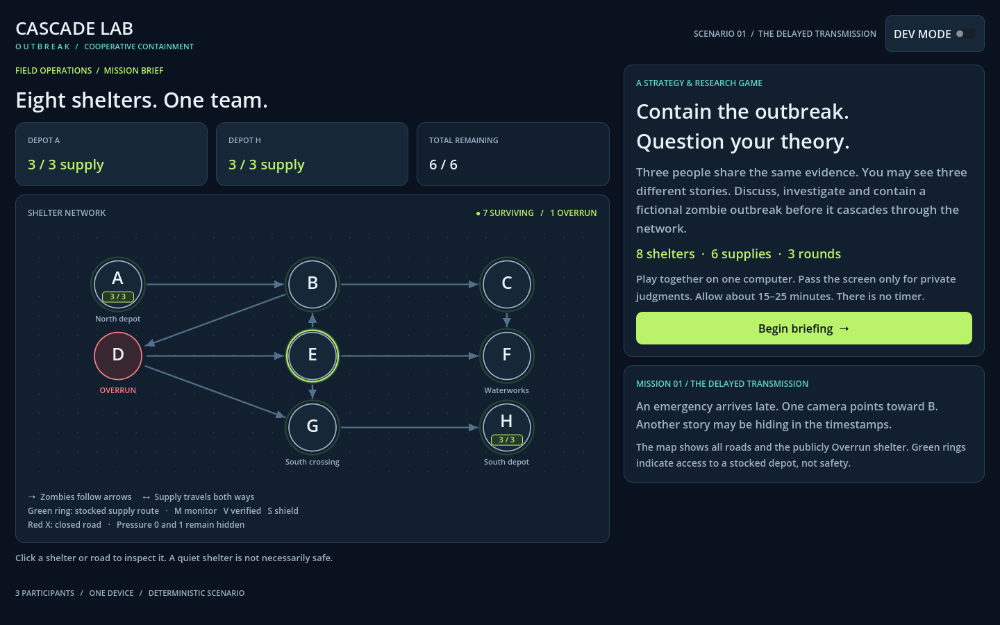

# CASCADE LAB: OUTBREAK

A complete, deterministic Godot 4 strategy MVP for **three people playing on one computer**. Discuss shared evidence, record private judgments, and contain a fictional outbreak across eight shelters in three rounds.

Uses GDScript, built-in Godot UI, and procedural drawing. No external art, plugins, backend, AI interventions, accounts, or networking are required.



## Run

1. Install **Godot 4.3 or later**, standard edition. Development and testing used **Godot 4.7.1 stable on macOS**.
2. Import `project.godot` in Godot's project manager.
3. Open the project and press **F6** with `Main.tscn` open, or **F5** to run the project.
4. Select **Begin briefing**. Read both **Reports** and **Rules** with your team.

The Compatibility renderer is configured. The designed viewport is 1440 × 900; the layout also runs at 1100 × 720 and typical laptop browser sizes. Content panels scroll. Fullscreen or a larger window makes group discussion easier. No internet connection is needed for native play.

## How to play

**Objective:** after the third spread, maximize surviving shelters. Pressure 0 and 1 both count as surviving. Overrun shelters cannot recover.

1. Read the shared briefing and map. Arrowheads show zombie direction; supplies travel in **both directions** along active roads.
2. Pass the screen to Players 1, 2 and 3. Each chooses a source, next shelter at risk, preferred action, and confidence. A blank privacy handoff separates players; forms have no default answers.
3. Compare the anonymous beliefs and discuss aloud. Proceed to Actions when the team is ready.
4. Click a shelter or road. Select an action, choose the paying depot, and add it to your plan. Scroll the Plan panel to see the queued plan. **Review & confirm** spends the supplies. Confirmed information results appear at the top of the panel and in the Investigation Log.
5. You can confirm multiple batches in one round. This lets you verify something, read the result, and then decide what to protect. You may spend any amount of your remaining supplies, including zero or all six. Nothing regenerates.
6. Clear or confirm the pending plan, then choose **Resolve Round … spread**. Review the summary.
7. After Round 1, the mandatory recovered evidence leads to three new private judgments and a belief-change comparison. Discuss and play Rounds 2 and 3.
8. Results show the final score, actions by round, investigations, alerts, belief changes, full event timeline, initial pressures, and the original source. **Export session JSON** saves a local file; **Play again** starts fresh.

Use the Reports, Log, Beliefs, and Rules tabs throughout discussion and actions. The game has no timer or automatic team choices.

## Exact rules and implementation choices

| Action | Cost | Effect |
| --- | ---: | --- |
| VERIFY | 1 | Reveals the target's current pressure in a permanent, dated snapshot. It never updates automatically. |
| MONITOR | 1 | Installs permanently. Reports all future pressure changes, including the old and new values. Does not reveal a baseline on installation. |
| SHIELD | 1 | Blocks **all incoming** pressure for one spread, then expires even if no zombies arrive. Does not heal, stop outgoing spread, or block supplies. |
| ISOLATE | 2 | Permanently closes one road to both zombies and supply. A crew must reach either non-Overrun endpoint. |

- Pressure is capped at 2. Each **already Overrun** shelter transmits +1 on every active outgoing edge. Resolution is simultaneous: newly Overrun shelters transmit starting next round. Multiple incoming transmissions stack.
- Supply routes use an undirected search over active roads and exclude all Overrun nodes, including depots. A route exists independently of its depot's stock; the green map ring specifically means a **stocked** depot can fund a one-unit action. A depleted depot can still appear in the structural route list but cannot pay.
- Both units for isolation must come from one depot. Splitting a cost between depots is intentionally not implemented. Stock at an Overrun depot remains in the total balance but cannot be used.
- Isolation previews show losses **per depot**, including losses that still leave another depot available. Previewing changes nothing. There is an explicit second warning confirmation, and the final plan review repeats each closure's supply consequences.
- A plan is dry-run on a separate copy before any real mutation. Invalid routes, duplicate monitors/shields, already closed roads, and overspending reject the whole plan with no partial effects. Costs are recomputed from action type.
- Every confirmed batch applies VERIFY and MONITOR first, in their selected order; then SHIELD and ISOLATE in their selected order. Later batches use the updated road network and balances. Information-first ordering is printed before confirmation.
- Private source answers allow any shelter. Next-at-risk answers exclude already Overrun shelters and include **None**. The second questionnaire omits preferred action as specified. "Source beliefs changed" counts source changes; next-risk and confidence changes are displayed separately.
- Anonymous labels are stable pseudonyms with a fixed display permutation, not names or player numbers. On a shared computer this is a privacy aid, not cryptographic anonymity. The complete session lives in local memory until exported; closing or restarting discards it.
- Gameplay and event ordering use no randomness or wall-clock time. Repeating decisions reproduces the same export content. Only the suggested export filename uses the current time.
- The pre-mission historical timeline describes how the initial conditions arose; it is not another simulated round or a source of additional gameplay edges. The public reports support a B-origin interpretation and a D-origin interpretation. The recovered timestamp weakens the claim that the observed B → D group initiated D's outbreak, without proving the source.

## Scenario data

The hand-authored mission lives in `scenarios/scenario_01.json`, loaded by `ScenarioData`. It contains node positions, shelter names, directed roads, initial pressures, depot locations and stock, public reports, the diagnostic reveal, original source, and historical timeline. The UI reads the scenario through this model; it does not resolve outbreak rules.

The living supply network has important junctions at B, E and G. Isolating G–H is a tempting way to protect the southern depot but removes the entire western network's route to Depot H. That becomes especially costly when Depot A's stock is depleted. Closing a road into an already Overrun shelter can have no *additional* supply-route loss, because that shelter was already unable to relay supply.

<details>
<summary>Scenario spoilers and reproducible strategy checks</summary>

Initial source: **D**. Initial pressures: A 0, B 1, C 1, D 2, E 1, F 0, G 1, H 0.

With no containment:

| Spread | Newly Overrun | Surviving |
| --- | --- | ---: |
| 1 | E, G | 5 |
| 2 | B | 4 |
| 3 | C, F, H | 1 |

A strong plan isolates **D–E from Depot A** and **D–G from Depot H** before the first spread. It saves all seven initially living shelters and leaves two supplies. Alternatively, shielding E from A and G from H in every round also saves seven but spends all six supplies. These are deliberately understandable containment strategies, not a difficult optimization puzzle.

A full tested UI playthrough verifies B from H, monitors and shields E from A, and isolates D–G from H in Round 1. Shield E again from A in Round 2. Round 3 overruns E and triggers its monitor; the mission ends with **6/8 surviving and zero supply**, with all four action types exercised.

The rule suite compares the strong strategy to 200 deterministic, test-only random legal-action trials: **7/8 versus 2.42/8 average**. The baseline chooses up to two legal actions each round until stock or routes prevent further actions; it is not meant to model a human team. Randomness exists only in this test, never in gameplay.

</details>

## Project structure

```text
project.godot
export_presets.cfg          Single-threaded Web preset; no deployment performed
scenes/Main.tscn            Root scene; native Control screens are composed in code
scenarios/scenario_01.json  All fixed mission data
scripts/
  scenario_data.gd          Scenario loader and data fields
  game_state.gd             Shelters, edges, depots, action history, observations
  game_manager.gd           Phase state machine, private judgments, spread, results
  network_manager.gd        Undirected supply routing and isolation previews
  supply_manager.gd         Funding eligibility and stocked reachability
  action_manager.gd         Validation, projection, confirmation and action effects
  event_logger.gd           UI-independent ordered events
  models/                   ShelterState, EdgeState, SupplyDepot, PlayerBelief,
                            GameAction and GameEvent
  ui/
    main.gd                 Menu, briefing, privacy, discussion, actions, results
    network_view.gd         Procedural map drawing and pointer hit testing
    ui_kit.gd               Reusable native UI construction and theme
    presentation_text.gd    Shared rules, reports and public-facing text
tests/
  test_rules.gd             Deterministic mechanics, flow, export and strategy tests
  test_ui.gd                Real scene/form/button/dialog end-to-end integration
```

One root scene composes the small screen set using native Godot Controls; separate `.tscn` files for each screen would duplicate the same layout. Domain managers and models are RefCounted objects independent of the scene tree. No Autoload singleton is required, making isolated test sessions straightforward.

## Validation

Latest local validation: **187 rule checks and 227 UI checks passed**, with no script errors in the final test logs. See [the validation record](docs/VALIDATION.md). Web export templates are not installed on the development machine, so the Web preset is prepared but a compiled browser build has not been tested or deployed.

With `godot` on your PATH, from the project folder:

```sh
godot --headless --path . --editor --import --quit
godot --headless --path . --script res://tests/test_rules.gd
godot --path . --script res://tests/test_ui.gd
```

On this Mac, replace `godot` with `/Applications/Godot.app/Contents/MacOS/Godot` (quote the executable path if needed). The first command builds the class/import cache in a fresh checkout.

The UI suite opens the actual game window, drives buttons and map input, fills both rounds of private forms, tests cancellation and disabled reasons, confirms multiple actions, resolves all rounds, exports a JSON file, changes viewport size, toggles dev mode, and restarts. It writes screenshots under `/tmp/cascade-lab-qa` and a sample session to `/tmp/cascade-ui-session.json`. It can also run headless, without screenshots. Inspect console output for `SCRIPT ERROR` as well as the test summary: Godot may return zero for some script-loading failures.

The mechanics suite checks supply directionality and obstruction, atomic spending, historical verification, monitor changes, single-phase shields, isolation, stacking, permanent Overrun state, simultaneous spread, privacy/phase gates, mandatory diagnostics, three-round completion, repeatable exports, reset, and strategy performance.

## Development mode

The clearly labeled **DEV MODE** toggle asks before exposing the source and pressure on every map node. The Dev tab during discussion/actions also lists supply routes, shields, monitors, all road states, and the previous spread's calculations. Round summaries include these calculations when dev mode is on. Reset is available through Restart.

Turning dev mode on permanently sets `dev_used: true` in that session's export, even after turning it off. Private handoff and questionnaire screens do not expose the debug view. No extra debug "advance" bypass is needed: the normal resolve button exercises the validated round flow.

## Session JSON

On native builds, **Export session JSON** opens a save dialog so you choose a user-accessible location. On Web, the same button invokes a browser download through `JavaScriptBridge.download_buffer`. It does not rely on browser virtual filesystem persistence.

Schema version 1 contains:

- `scenario_id`, `intervention` (always `NONE`), and `dev_used`.
- `events`: ordered `GameEvent` objects with `order`, `round`, `type`, `target`, `old_value`, `new_value`, and `metadata`.
- Both anonymous belief collections, structured verification snapshots, monitor alerts, and the shared investigation log.
- Final shelters, road states, depot balances, confirmed actions, round summaries, and ground truth.

The event stream records session start/completion, private submissions/updates, action selection, plan clearing, supply spending, verification, monitor installation/alerts, shields/application/expiration, isolation, pressure changes, newly Overrun shelters, diagnostic evidence, and round completion. Events include hidden pressure for later research analysis; the full event stream and truth are only presented to players at results or in clearly identified dev views. A future backend can ingest these same event objects after adding authenticated session/room identifiers and a separate real-time audit clock.

## Future AI support

`GameManager.InterventionType` defines `NONE`, `DIRECT_RECOMMENDATION`, and `CONSTRUCTIVE_DISSENT`. The current session always uses `NONE` and records an intervention-skipped event. A reserved phase boundary supports:

```text
Private beliefs → Initial discussion → Intervention → Final discussion → Team action
```

There is no AI implementation and no intervention affects an MVP decision. The present NONE boundary opens the single normal discussion screen; a future experimental condition can split that screen into initial and final discussion without coupling action validation to an AI response.

## Future Multiplayer Architecture

**Phase 1: current single-device MVP.** One local `GameManager` owns the complete state. Players share a screen except during the six private handoffs.

**Phase 2: Godot Web export hosted on itch.io.** Deliver the same local cooperative game through a browser. Hosting alone does not add multiplayer or server-side confidentiality.

**Phase 3: room-code multiplayer.** Use an authoritative server, room-scoped participant identities, private belief submissions, and public state projections:

```text
Player 1 ─┐
Player 2 ─┼─→ authoritative server ─→ shared GameState
Player 3 ─┘            │
                       └─→ filtered public view + permitted observations to clients
```

The server must control hidden Zombie Pressure, scenario ground truth, resource counts, action validation, zombie resolution, experiment condition, and logging. It should validate cost and current round on every command, deduplicate retries, serialize confirmations, and broadcast only the resulting public state and permitted verification/monitor observations. Private beliefs go only to the server until the scheduled anonymous reveal.

**Clients should NOT eventually receive hidden state.** The local MVP necessarily bundles the JSON scenario and stores hidden values in memory; hiding labels cannot protect them from a determined client. Move the ground-truth scenario and managers to the server, and replace the UI's local state reference with a public projection containing only public Overrun flags, roads, inventories, shields, monitors, dated verification observations and authorized alerts. Do not ship the hidden scenario resource in a competitive or controlled research client.

Keep Godot Web clients compatible with browser-supported networking transports (for example WSS). Implement reconnection, a shared round barrier, room lifecycle, and experiment assignment at the server rather than inside button callbacks.

## Future Web / itch.io deployment

**Nothing has been deployed.** A Web preset is included with threads and extensions disabled, Compatibility rendering, automatic canvas resizing, and an explicit include filter for the scenario JSON. Install export templates matching your Godot version first.

1. Open Godot and this project.
2. Choose **Project → Export**.
3. Select the included **Web** preset, or **Add → Web** if recreating it. Keep **Use Threads / Thread Support off** and include `scenarios/*.json`.
4. Export the project into a clean folder, using **`index.html`** as the filename. The preset defaults to `build/web/index.html`; create the directory first.
5. Verify the generated **HTML, WASM, PCK, JavaScript and supporting files** are present. Preserve their filenames and relative paths. Test through Godot's local Web preview or a local HTTP server; do not open `index.html` with `file://`.
6. ZIP the **contents** of the Web export folder, with `index.html` at the ZIP root.
7. Create an itch.io project and choose an HTML/browser game.
8. Upload the ZIP.
9. Mark **“This file will be played in the browser.”**
10. Configure an approximately 1440 × 900 viewport or a sensible laptop-sized responsive embed, enable fullscreen, and retain the exported file paths.
11. Test the hosted game in Chrome: every handoff, all four actions, the Round 1 evidence, three-round completion, JSON download, restart, window resizing, and fullscreen. Check another browser before wider distribution.

Godot 4 Web uses **WebGL 2.0 and the Compatibility renderer**. Godot 4.3+ supports single-threaded export, which avoids the cross-origin isolation requirements associated with threaded exports. This small turn-based MVP uses no workers or custom extensions. Browser download and fullscreen behavior require user gestures; the game initiates JSON download from a button. Web builds require a supported browser and WebGL enabled; native success alone does not prove Web compatibility. See the [official Godot Web export documentation](https://docs.godotengine.org/en/stable/tutorials/export/exporting_for_web.html) for the current platform constraints.

## Scope and limitations

This is a local playable prototype with one fixed mission. It intentionally omits online multiplayer, backend storage, AI decisions, account identity, save/resume, additional scenarios, healing, audio, and external assets. It is prepared for Web export but requires a real browser smoke test of the exported build before publication. Desktop testing does not substitute for that deployment check.
