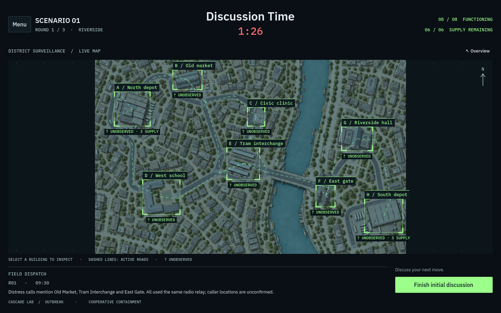
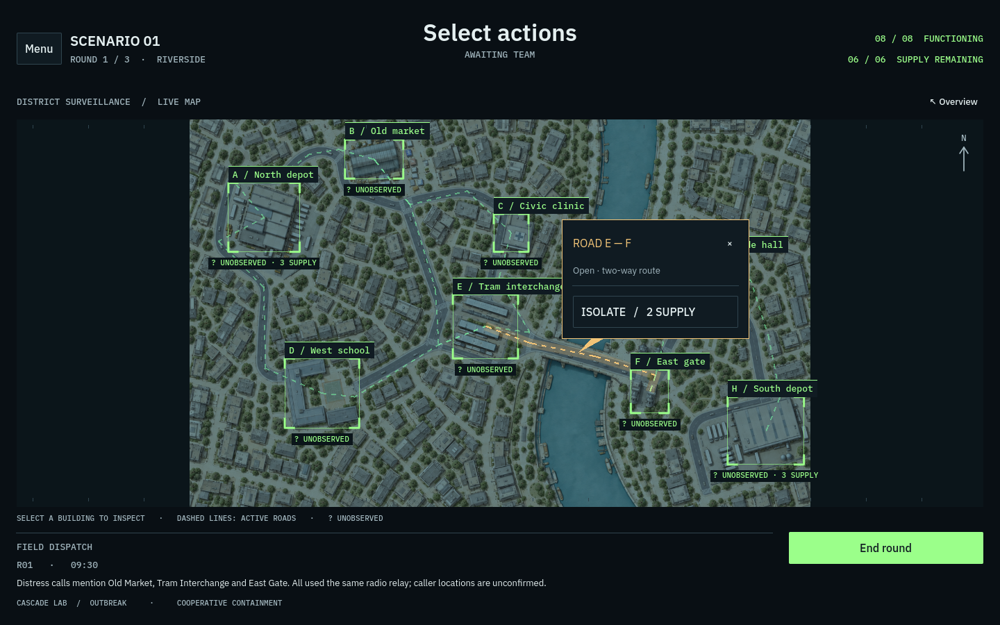
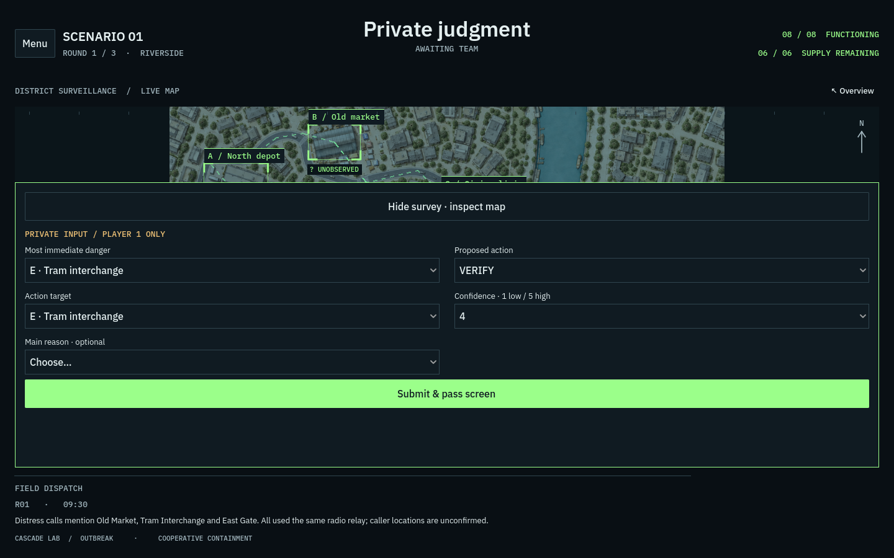
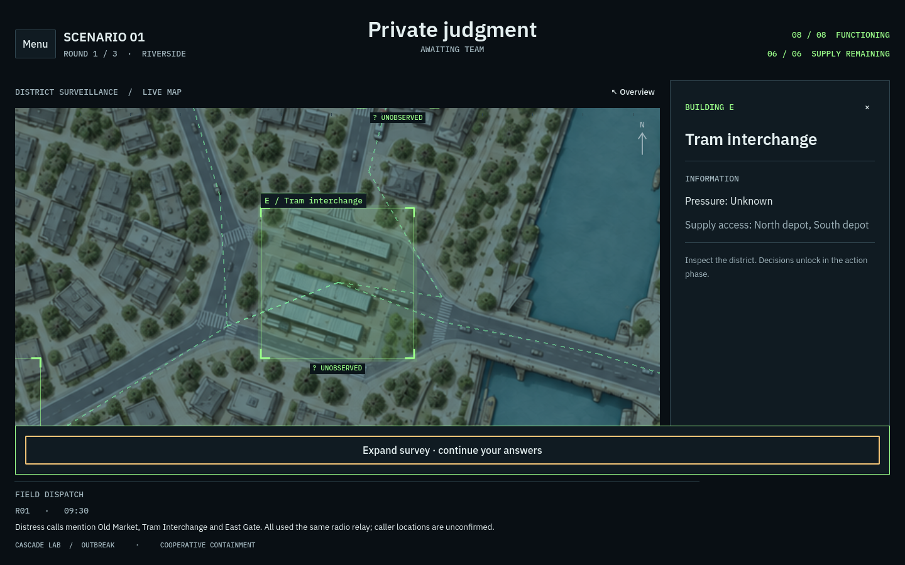

# Dark city interface

The September 2026 redesign implements the supplied sketches in the existing Godot game. The black frame in the reference is treated as the screen boundary. The surrounding presentation paper is not part of the game.

## Interaction and layout

- A dark, readable operations console uses Plex Sans for information and Plex Mono for map labels, status, and the red timer. Green corner frames identify all eight playable buildings, with each building's name at the upper left.
- Building selection animates the camera over 0.55 seconds and opens a right information panel. The building name precedes a divider and public information. During actions, a second divider separates the Verify, Monitor, and Shield buttons.
- Overview, an empty-map click, or Escape restores the district. Wheel zoom, zoom buttons, and manual panning are removed.
- Roads remain at the current camera scale and open a square speech bubble beside the route. The Isolate button is inside the bubble. The existing confirmation and supply-route preview still explain the consequences before dispatch.
- The private survey expands over the lower map. Hide survey retracts it; the same button becomes Expand survey. Map inspection preserves every unfinished answer and never submits a form. The opaque handoff clears the outgoing player's form before the next player sees it.
- Menu contains the field guide, setup, restart, and facilitator controls. The field dispatch and phase action remain below the map.

## Timing and experimental controls

The discussion countdown starts at 2:00 after the third private submission. It automatically opens the decision pause at zero. The existing Finish initial discussion button remains available for an early transition. The decision pause retains its 15-second minimum, and the red header timer shows its remaining time. Untimed phases have a status label rather than a fictional countdown.

All three support conditions use the same 380-pixel sidebar and 440-pixel message card, with identical fonts, headings, and minimum exposure. All twelve existing message templates are checked for equal height and room above the continuation control at both desktop sizes. No support text, generation rules, permitted inputs, privacy filtering, or export schema was changed.

## Artwork and game rules

`assets/maps/riverside.png` is a copy of the existing `output/imagegen/scenario-01-riverside-city-roads.png`. A runtime tint darkens the artwork without modifying the source image. Building bounds and visual road paths in NetworkView register the artwork to the interactive overlays. The dashed overlay defines the playable road network; other illustrated streets are scenery.

Visual coordinates are separate from simulation geometry. The scenario's eight shelters, nine roads, shortest-route costs, six total supplies, outbreak progression, action legality, delivery effects, and three rounds are preserved. Hidden pressure 0 versus 1 does not alter public rendering. Dev-only pressure is suppressed during private input.

## Validation and delivery

The redesign checks cover all eight focused building frames, wheel-zoom removal, road bubbles, survey answer retention, private handoffs, countdown expiry, equal support layouts, and action confirmation. Existing rule, support, UI, and presentation suites cover delivery, closure, resolution, results, restart, and exports.

Visual checks target 1440 × 900 and 1200 × 800. The browser build is also exercised locally for startup, building focus, privacy handoff, and the survey drawer. Smaller portrait layouts are outside this desktop pass.

The browser export is `build/dark-web/`. The upload-ready archive is `build/cascade-lab-dark.zip`, with `index.html` at its root. No remote deployment is performed.

## Previews

