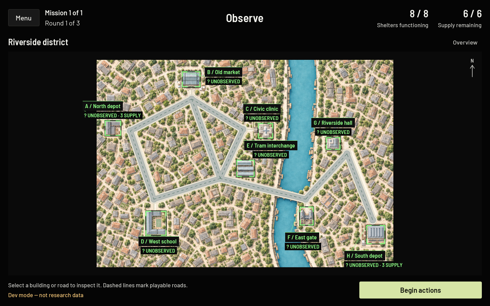
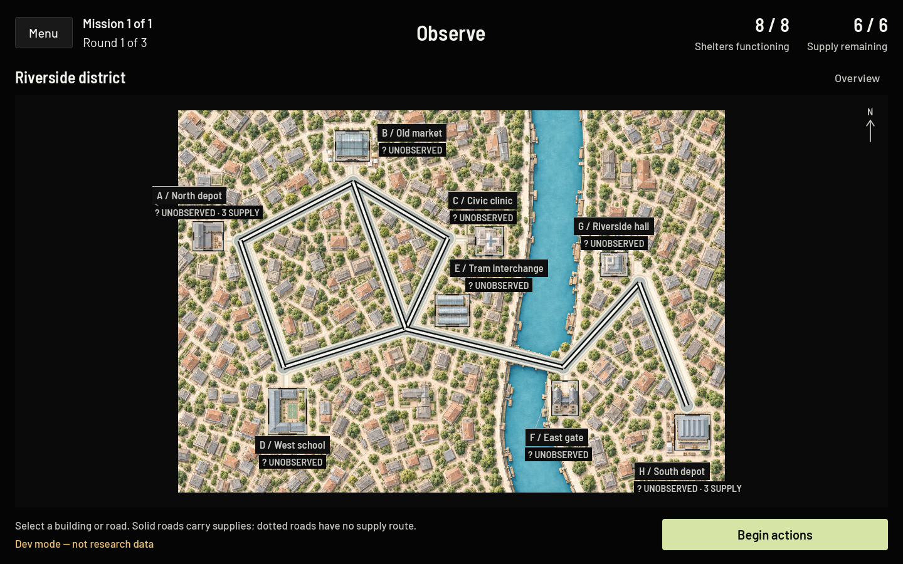
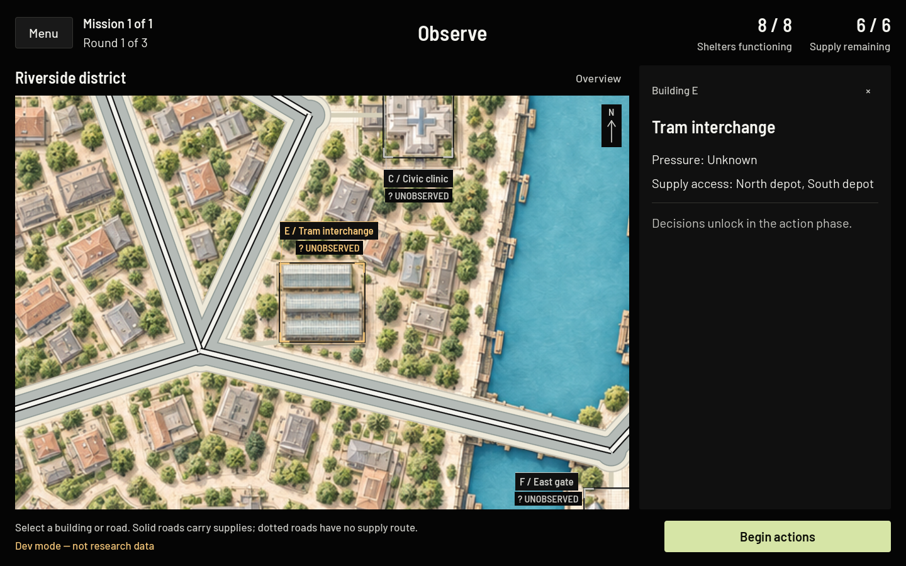
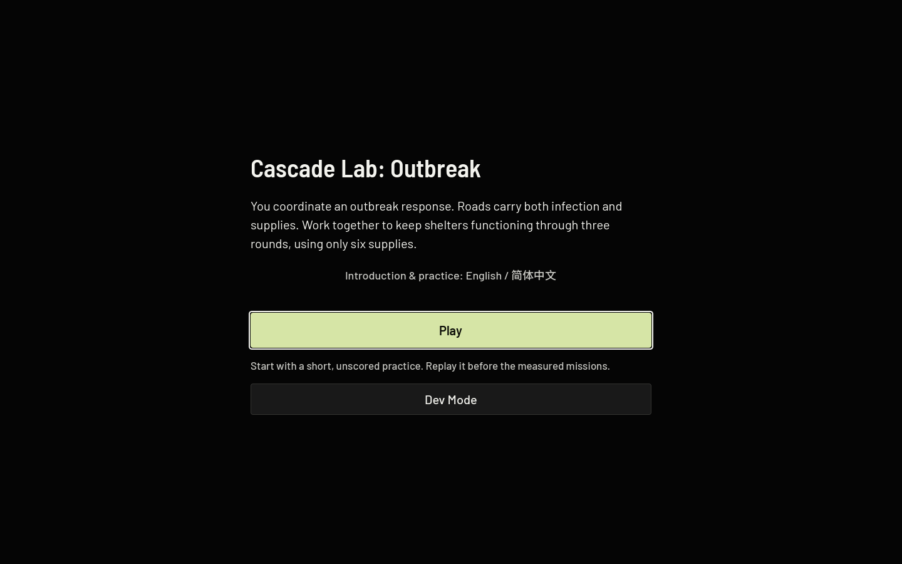
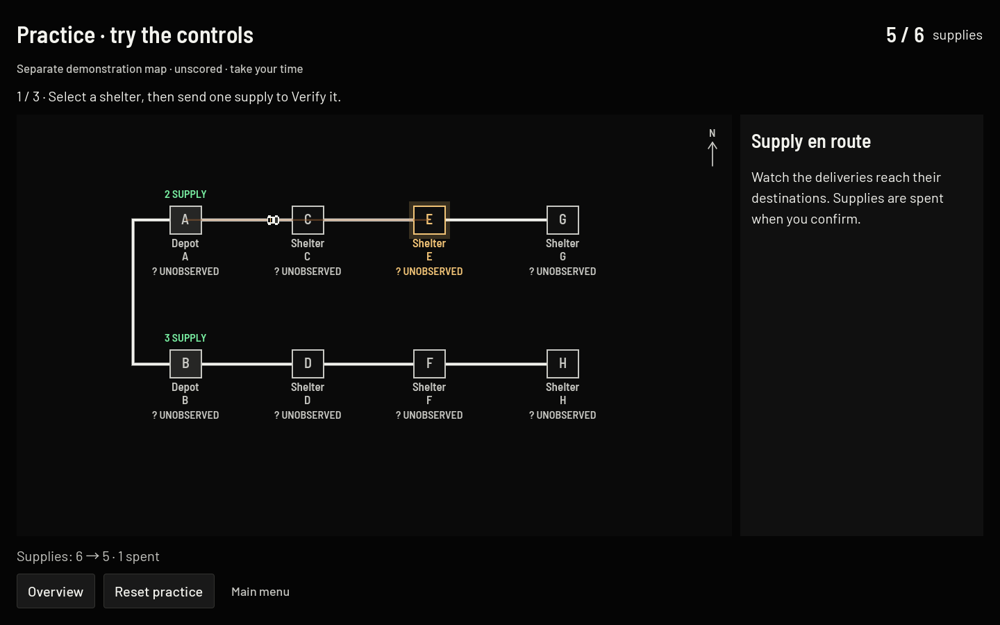
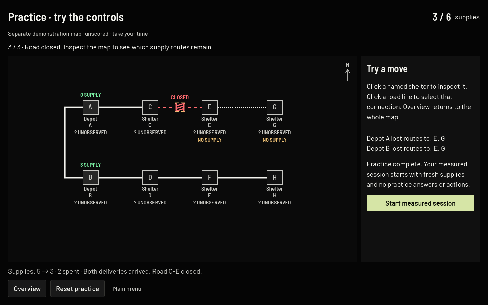
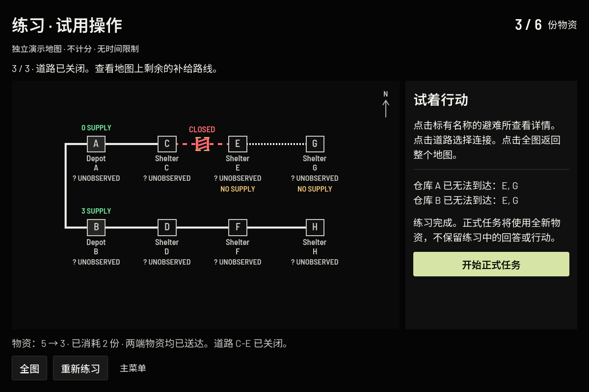
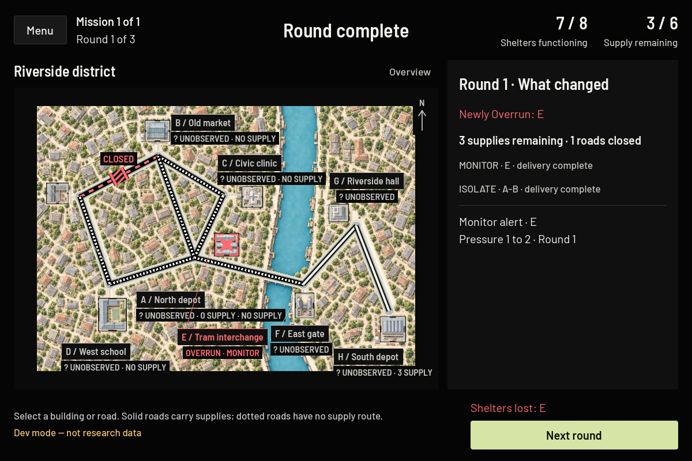

# First-play and readability review

Implemented locally on 5 October 2026. **Proposed protocol addition; supervisor review is required before participant testing.** Nothing was deployed, committed, pushed, or changed in cloud resources or historical research records.

## Walkthrough

1. The opening explains the playable situation: coordinate the response, use roads that carry infection and supplies, and keep shelters functioning for three rounds with six supplies.
2. In this development build, **Play** opens a separate, unscored demonstration district. Select any shelter and send a **Verify** delivery. The counter changes from six to five; the vehicle arrives; a dated observation appears. There is no countdown.
3. Select a road. Read the existing route-loss preview, then close it with two deliveries. The counter decreases by two, a barricade appears, and disconnected supply routes become dotted. This explains consequences without recommending a measured-game strategy.
4. Inspect the resulting map, replay using **Reset practice**, or choose **Start measured session**. The four-mission session begins at round one with six supplies, empty responses, empty observations, and no practice actions. Its first navigation button says **Choose your first move**, with an explicit note that this records a private proposal and does not execute it.

The flow is short enough for roughly a minute of reading and interaction, but completion time has not been measured with newcomers. The practice controller contains no research survey, AI provider, outbreak resolution, or measured-session binding. It reuses `GameState`, `ActionManager`, `SupplyManager`, pathfinding, and `NetworkView`.

## Implemented presentation changes

- Playable road cores increased from 1.5px to a bounded 4–6px, with 2px dark casing on each side. The hit radius is 10px. These are logical screen-space units; the viewport may scale them with the rest of the UI.
- Open stocked routes are solid. Unavailable supply routes have short dots. Closed roads have longer dashes, a barricade, and a CLOSED label. Selected roads have brackets as well as an amber highlight.
- Road coordinates, endpoints, artwork, path costs, routing, closures, and infection rules are unchanged. The annotation clearance calculation accounts for the visible road width.
- Per the subsequent color revision, shelter names and frames use their original green. The `? UNOBSERVED` status retains neutral text on a black box. Monitoring, shields, supply access, and confirmed Overrun remain distinct. Verify cards explicitly say “dated snapshot.”
- Existing delivery vehicles and barricades have readable size limits. A short arrival hold labels the destination DELIVERED. The supply receipt shows before, after, and amount spent.
- Existing blocked-transmission feedback now draws a shield symbol; Overrun transitions add a concise label to the existing crossed mark. No “saved shelter” claim is made.
- Round recaps list newly Overrun shelters, remaining supplies, the total number of closed roads, this round's completed actions, purchased Verify/Monitor observations, and expired shields. They do not read hidden damage or pressure calculations.
- Barlow Semi Condensed, Barlow, Noto Sans SC, neutral-black surfaces, privacy handoffs, saving notices, and the Qwen backend remain intact. Survey questions, scales, required responses, AI input projection, support text, condition assignment, and discussion/support clocks are unchanged.

## Screenshots

The screenshots below record the initial review; the later requested color revision restores green shelter names and frames while keeping UNOBSERVED boxes black with neutral text.

Screenshots are native Godot captures. The before pair was captured before editing; the after pair uses the same Riverside map, overview, and E close-up. Click images for their full size.

| Scale | Before | After |
| --- | --- | --- |
| Overview · 1440 × 900 |  |  |
| Close-up · 1440 × 900 |  |  |

Opening:

Hands-on delivery:

Practice closure and route changes:

Simplified Chinese practice at 1200 × 800:

Public round recap at 1200 × 800:

Additional evidence: [1200 overview](screenshots/first-play/after/roads-overview-1200.png), [1200 close-up](screenshots/first-play/after/roads-closeup-1200.png), [Chinese opening](screenshots/first-play/after/1200-zh-opening.png), [Twin Districts](screenshots/first-play/after/twin_districts_02_v1-overview.png), [Lifeline](screenshots/first-play/after/lifeline_03_v1-overview.png), [Crossfire](screenshots/first-play/after/crossfire_04_v1-overview.png).

The [blocked-response capture](screenshots/first-play/after/blocked-1440.png) freezes the existing animation at 85% using real public transmission paths after real game actions. It is a visual QA frame, not an additional game phase. The test checks that the shield actually blocks incoming transmission and that changing concealed target pressure does not change these pixels.

## Validation

| Suite | Result |
| --- | --- |
| Mechanics | 507 checks, 0 failures |
| Missions | 661 checks, 0 failures |
| Scenario fixtures | 263 checks, 0 failures |
| Support privacy, legality, timing | 2,004 checks, 0 failures |
| Asynchronous support | 18 checks, 0 failures |
| UI integration | 193 checks, 0 failures |
| Four-scenario mission UI | 2,310 checks, 0 failures |
| Windowed presentation, all three conditions, both requested sizes | 5,784 checks, 0 failures |
| Redesign layouts | 1,372 checks, 0 failures |
| Session UI | 168 checks, 0 failures |
| Road/art geometry and selection | 134,800 checks, 0 failures |
| Windowed first-play: both sizes, English/Chinese, reset, replay, gates, fresh state, hidden-pixel invariance | 771 checks, 0 failures |
| Practice isolation with saving enabled, temporary outbox, and backend adapter retained | 10 checks, 0 failures |
| Public feedback and recap, including concealed-pressure pixel invariance | 180 checks, 0 failures |
| Python backend suite | 35 passed; 11 PostgreSQL tests skipped |

The backend suite used mock providers and temporary local servers/data, including real native HTTP, offline queue recovery, access-code recovery, and outbound Qwen-context interception. The live Qwen service and a PostgreSQL database were not contacted.

The browser preview exported successfully and passed a manual in-app Chromium smoke test: opening → select shelter → delivery (6 → 5) → road selection → two deliveries and closure (5 → 3) → fresh measured mission (6 supplies, round 1 of mission 1). The browser console reported no warnings or errors. This preview disables saving and network activity in an isolated build copy. It is not a participant or backend integration build.

The existing city-art/presentation tests used fixed delivery sleeps; those waits now follow phase completion with a bounded timeout to accommodate the arrival hold. An initial simultaneous-window screenshot run produced a focus-related pixel mismatch; the isolated windowed presentation run passed. No hidden-information checks were removed or relaxed.

## Protocol-sensitive changes requiring supervisor review

1. **Practice exposure:** approve the demonstration map, two-action sequence, common instructions across all three conditions, placement before measured missions, repeat/reset policy, and expected duration. It may change participant familiarity and should be versioned as a protocol addition.
2. **Participant enablement:** practice defaults off when development access is disabled or the `participant` export feature is present. Enabling `cascade/practice_approved=true` requires approval. This task has not enabled that setting or published a participant build. The existing access-code check guards both practice and measured entry.
3. **Completion metadata:** `practice-1` completion is held separately in UI memory, outside measured records. It is not persisted or uploaded. A durable completion/attempt record would require a reviewed schema and retention decision.
4. **Instruction wording/language:** approve the new premise, proposal-navigation wording, practice copy, and Simplified Chinese translation. The language switch is explicitly scoped to introduction/practice. Research surveys and existing map/action vocabulary have not been translated or rewritten.
5. **Feedback exposure:** approve thicker road states, neutral uncertainty status boxes, the public outcome recap, and more legible arrival/blocked/Overrun feedback consistently across conditions. These add salience to existing public facts and may affect decisions despite unchanged mechanics.
6. **Animation duration:** the arrival hold adds 0.55 seconds; very short delivery travel has a 0.7-second minimum (previously 0.5). AI display timing and required discussion/pause durations are unchanged. Approve this small action-display duration change with the rest of the presentation update.

No effect revealing hidden sources, concealed P0/P1 pressure, incubation, or counterfactual shelter survival was implemented. The blocked shield uses only already-visible Overrun-source transmission along public open roads and an installed public shield; it does not show hidden incubation protection.

## Limitations and reproduction

- No participant pilot, supervisor sign-off, live Qwen call, PostgreSQL run, cloud change, or deployment was performed.
- Both requested sizes and zoom scales were verified natively. Browser verification was a smoke test at the browser's normal viewport; exact-size browser overrides behaved inconsistently in the embedded browser and are not claimed as validated. Safari/Firefox and the full four-scenario/three-condition browser matrix remain unverified.
- English and Simplified Chinese introduction/practice text render with the existing font fallbacks. The measured interface and survey remain in their existing language. This is not a full-game Chinese localization.
- Practice records are ephemeral. The demo uses real mechanics but does not run resolution, surveys, AI, or scores. Human learning effects and timing require review/piloting.
- Native checks used the installed Godot 4.7.1 runtime; no signed native distribution was packaged.

Run with `/Applications/Godot.app/Contents/MacOS/Godot --path . --script res://tests/test_first_play.gd -- --offline-tests` for windowed first-play checks. `tests/test_practice_isolation.gd` checks the saving boundary. `tests/capture_feedback.gd` checks and captures public feedback. Run these in separate windows sequentially for stable pixel comparisons.

Run `python3 -m unittest discover -s backend/tests -t . -v` for the backend suite. Run `python3 tools/build_first_play_preview.py` to export an isolated offline browser preview to `/tmp/cascade-first-play/web`; serve that directory locally. This helper does not modify the source game's saving configuration or release builds.
