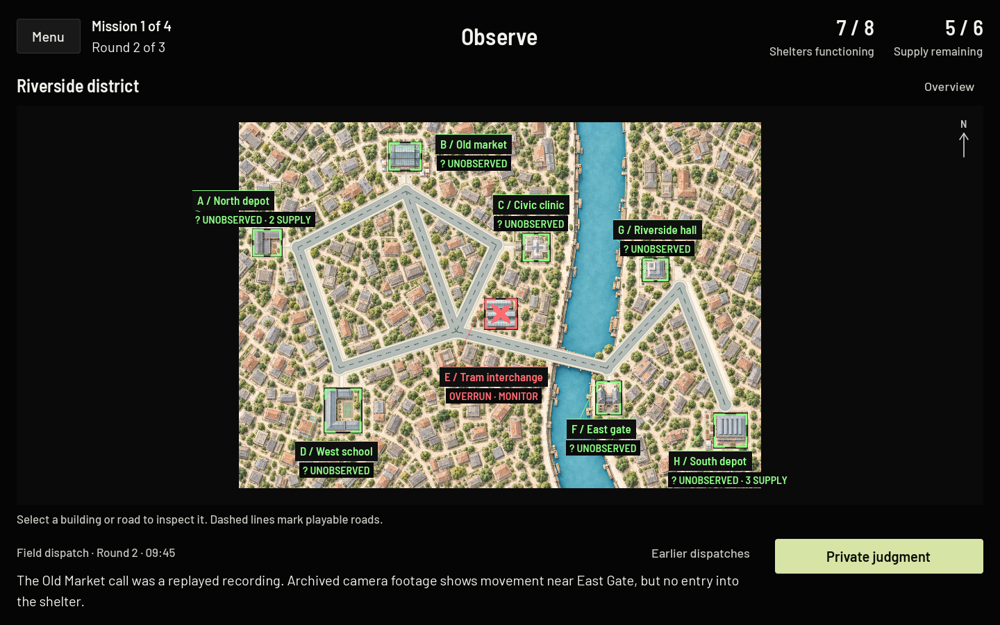
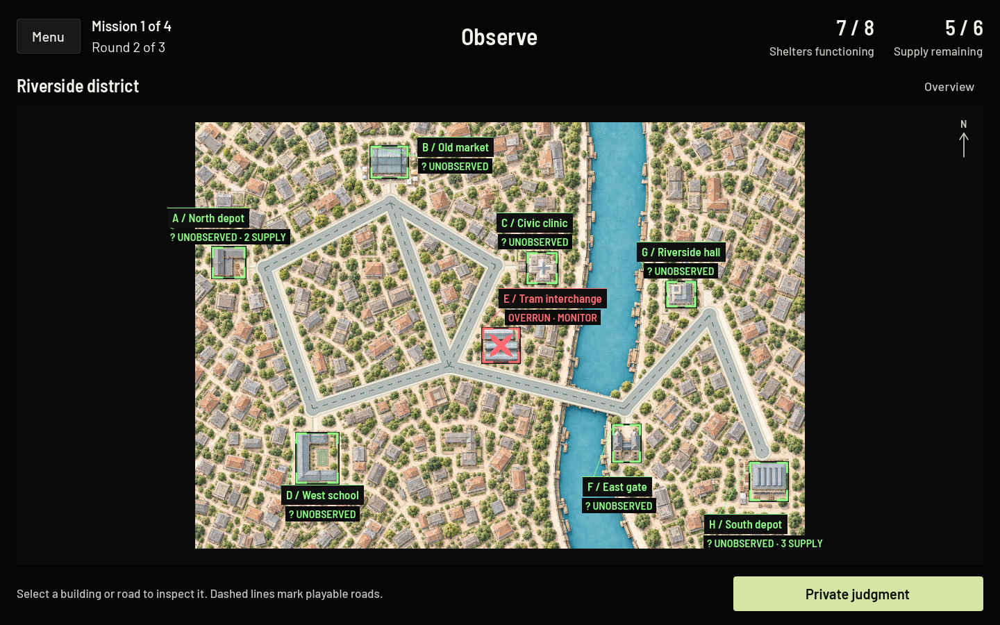
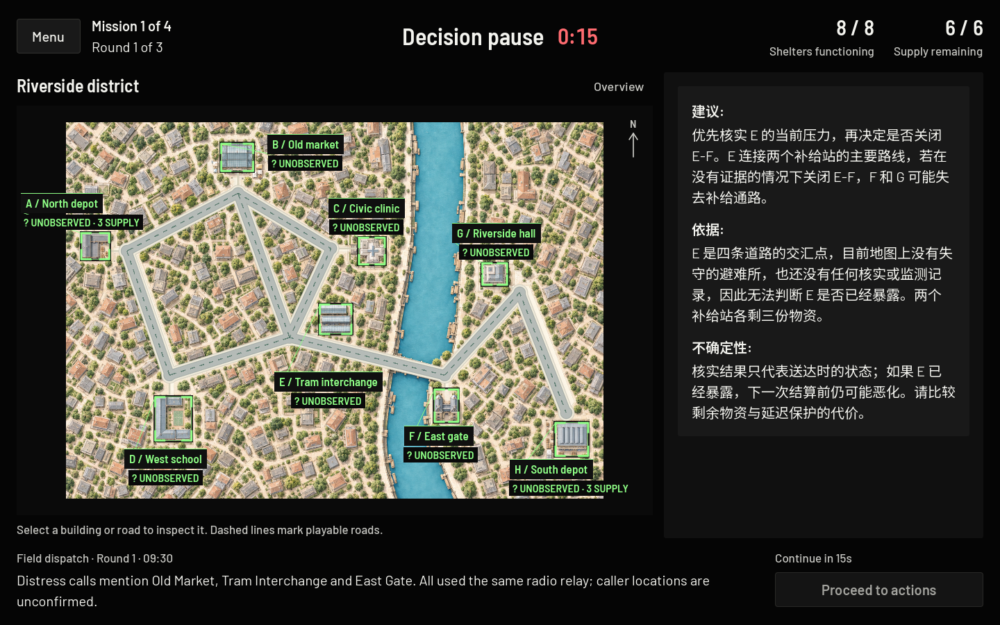
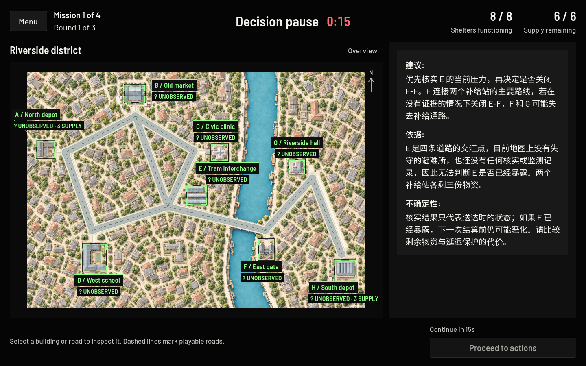

# No-dispatch context — October 2026

Scripted narrative dispatches (fictional distress calls, archived recordings, patrol photos and similar “field dispatch” reports) are removed from Cascade Lab: Outbreak. The study now concerns team reasoning about the road network, risk and supply trade-offs. Nothing replaces the dispatches.

Unchanged: mechanics, initial exposures, scenario topology, supplies and costs, legal actions, the three conditions and their role instructions, surveys, the two-minute discussion, the 15-second reading pause, saving, export and the No-AI rule that no provider is called.

## What players and models still receive

- Road connections and closures, depot supplies, costs and legal actions.
- Publicly visible Overrun shelters; unknown pressure stays unknown.
- Dated Verify snapshots (`OBS R1 · Pressure 1 at verification`) and Monitor readings and alerts.
- Previous team actions, intervention results and outbreak progression.
- The three anonymous initial private responses (structured fields only).
- Functional instructions, error messages and save/connection notices.

## Versions

| Item | Before | Now |
| --- | --- | --- |
| Support context contract | v1 (implicit, carried `public_reports`) | `cascade-context-2` (`SupportContext.VERSION`, `validation.CONTEXT_VERSION`) |
| Qwen prompt | `cascade-zh-2` | `cascade-zh-3` |
| Backend session metadata | schema 5, `cascade-development-5` | schema 6, `cascade-development-6` |
| Game/mission JSON export | schema 4, with `public_intel` | schema 5, with `context_version`, no `public_intel` |
| Local template library | `support-1.0.0` | `support-1.1.0` (two templates no longer mention reports) |

New sessions record `context_version` in `MISSION_STARTED`, `SUPPORT_SHOWN`, the `AI_REQUESTED` audit, every intervention job audit and every returned message. `db_admin export` adds a `context_version` column (older jobs show `legacy (pre cascade-context-2)`).

## How dispatch data is blocked from Qwen

1. **No source.** `public_intel` is gone from all four scenario files. `ScenarioData` lists it in `DEPRECATED_FIELDS`: an older file still loads, but the field is never copied into a `ScenarioData`, so it cannot reach play, events, exports or support.
2. **No flow.** `GameManager` has no report list, publishes nothing at round boundaries and logs no `PUBLIC_INTEL_SHOWN` events. The UI has no Field dispatch section, history button or dialog, and the field guide no longer mentions reports.
3. **No slot in the contract.** `SupportContext.build(state, responses, exposure_progresses)` has no report parameter or field. `published_reports` is gone from the input categories.
4. **API gate.** The intervention request must be exactly `{condition, context_version, context}` with `context_version == "cascade-context-2"`. Any retired field name (`public_reports`, `public_intel`, `published_reports`, `reports`, `report`, `intel`, `dispatch`, `dispatches`, `field_dispatch`, `field_dispatches`) at any depth returns `400 deprecated_report_field` before a job exists. Otherwise the context must match the explicit allowlist exactly, with legal actions recomputed server-side.
5. **Provider gate.** `QwenProvider` and `MockProvider` re-run the same validation before any network call. A direct call with a retired field fails with `invalid_context:deprecated_report_field` and sends nothing.
6. **Prompt.** The system prompt describes only the permitted snapshot and keeps the untrusted-data rule for player responses and display names. Mock replies, fallback messages, templates and test examples contain no dispatch wording.

Full scenario files, ground-truth timelines, exports, raw event logs and private audit records are never part of the snapshot. The researcher-only ground truth stays in scenario files and game exports, outside participant views and model inputs.

## Compatibility with older clients and records

- **Queued records.** Browsers and desktops keep their outbox (`cascade.synthetic.outbox.v1`). Schema-5 sessions still start, upload events and complete on the new backend, so historical records are preserved with their original `cascade-development-5` metadata. Nothing is flushed or rewritten.
- **Old clients cannot get AI messages.** Any intervention request from a schema-5 session returns `400 deprecated_session_protocol`, so the old game shows its visible “AI support unavailable” notice and audits `AI_FAILURE`. This is never a silent fallback to the old dispatch-based context.
- **Cached results.** A completed job produced under another prompt or context version is never returned (`409`), whether by retry or poll. New sessions always have new random IDs and cannot read other sessions' jobs. The client also refuses any message whose `context_version` is not `cascade-context-2`. Restarted backends already fail every pending job with `backend_interrupted`.
- **In-progress sessions.** A session that began on an old build keeps its old interface, but its later AI requests fail visibly. Deploy between sessions; start a fresh session after upgrading.
- **Database.** No schema migration; existing rows are untouched.

## Deployment

Nothing has been deployed. When ready:

1. Wait until no sessions are running.
2. Deploy the backend (Render) from this code. No database change is needed.
3. Re-export both Web presets and replace the itch.io upload in the same window. An old cached page can still save records but cannot obtain AI messages.
4. Run the synthetic check from DEPLOYMENT.md with the mock provider. A live Qwen smoke call is billable and needs explicit approval.
5. Optional: `python3 -m backend.db_admin export` and confirm new sessions show `cascade-development-6` and `cascade-context-2`.

## Verification

`backend/tests/test_no_dispatch.py` covers the contract, both validation gates, versioning and cached results. Its end-to-end test runs the real Godot game and HTTP client (`tests/test_outbound_context.gd`) against a real localhost backend whose `QwenProvider` uses a **recording fake transport**. The scenario is an older-format file still carrying every retired dispatch plus unique sentinels. The test inspects the exact serialized request bodies, system and user messages, that would be sent to Alibaba. This verifies what the code would send. It is **not** a live Qwen connection test; no Alibaba request was made.

Run it with the rest of the backend suite:

```sh
GODOT_BIN=/Applications/Godot.app/Contents/MacOS/Godot python3 -m unittest discover -s backend/tests -t . -v
```

`CASCADE_PAYLOAD_SAMPLE=/tmp/cascade-payload.json` additionally writes one captured synthetic request body.

## Permitted outbound context (synthetic, abridged)

Round 2 of a Direct-Recommendation session after Verify E and Monitor E in round 1 (all eight shelters and nine roads are present in the real request):

```json
{
  "model": "qwen-plus", "temperature": 0.3, "max_tokens": 700, "enable_thinking": false,
  "response_format": {"type": "json_object"}, "stream": false,
  "messages": [
    {"role": "system", "content": "You provide one support message ... Use only the supplied public snapshot: road network and closures, depot supplies, previous team actions, dated Verify/Monitor observations, public rules, and anonymous initial responses. ... [role instruction]"},
    {"role": "user", "content": {"public_snapshot": {
      "round": 2, "remaining_budget": 4, "depots": {"A": 1, "H": 3},
      "shelters": {"E": {"overrun": true, "known_pressure": 2, "monitored": true, "shielded": false,
                          "verified_history": [{"round": 1, "pressure": 1}]},
                    "F": {"overrun": false, "known_pressure": -1, "monitored": false, "shielded": false, "verified_history": []}},
      "roads": {"E-F": {"endpoints": ["E", "F"], "closed": false}},
      "previous_actions": [{"type": "VERIFY", "target": "E", "round": 1, "cost": 1, "depots": ["A"]},
                           {"type": "MONITOR", "target": "E", "round": 1, "cost": 1, "depots": ["A"]}],
      "responses": [{"danger_location": "E", "preferred_action": "VERIFY", "action_target": "E", "confidence": 4, "reason": "gather more information"}],
      "public_rules": {"costs": {"VERIFY": 1, "MONITOR": 1, "SHIELD": 1, "ISOLATE": 2, "WAIT": 0}, "...": "..."},
      "display_names": {"E": "Tram interchange", "E-F": "Road E-F"},
      "legal_actions": [{"action": "VERIFY", "target": "F"}, {"action": "WAIT", "target": "NONE"}]
    }}}
  ]
}
```

The real user message is the canonical JSON string of `{"public_snapshot": ...}`. The Constructive-Dissent request is byte-identical except for the role sentence at the end of the system message.

## Limitations

- Scenario `ground_truth_timeline` entries (researcher-only) still describe the retired reports, for example “Scheduled city-surveillance reports begin.” They are preserved as historical research material and never shown or sent. Revise them only with the research team.
- `docs/STUDY_GAMEPLAY_DESCRIPTION.md` and earlier validation and design records still describe reports; they were not rewritten.
- Mission titles are unchanged; “Crossfire: Converging Threats” still hints that more than one threat exists. Review it separately if needed.
- The browser outbox key is unchanged, so old queued records upload under their original metadata, by design.

## Screenshots

The Field dispatch strip is gone. The map hint and phase action now share one bar under a taller map.

| Before | After |
| --- | --- |
|  |  |
|  |  |
