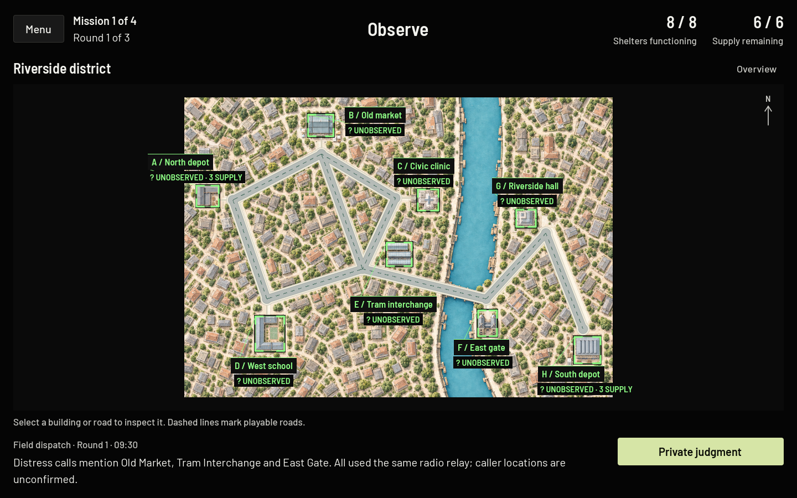
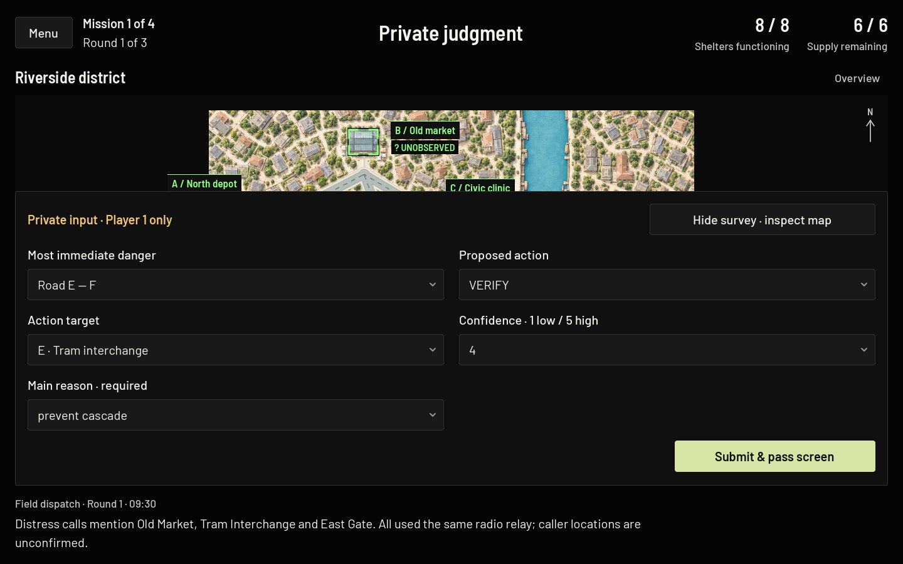
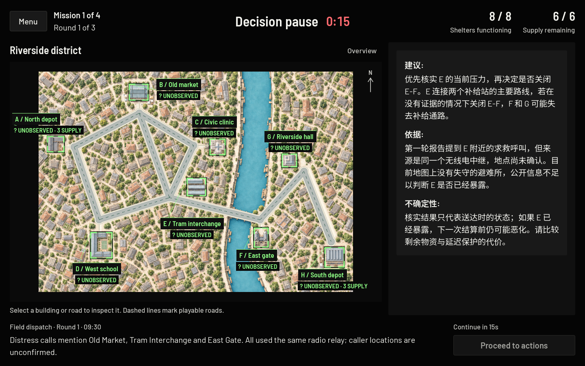

# Option A typography and neutral surfaces — October 2026

A presentation-only update of every player-facing screen. Game rules, scenarios, maps, experimental conditions, survey wording and options, AI prompts and message text, information availability, intervention timing, saving, and data collection are unchanged. All three conditions use the same renderer, fonts, card size, and pause.

## Typography

| Role | Face | Size at 1440 × 900 |
| --- | --- | ---: |
| Main screen headings (phase title, main menu, handoff) | Barlow Semi Condensed SemiBold | 34 (menu 40, handoff 36) |
| Panel headings (building name, modal titles, map title) | Barlow Semi Condensed SemiBold | 28 (map title 26, guide sections 24) |
| Body text, instructions, dispatches, AI messages | Barlow Regular | 20, line height 30 |
| Survey questions | Barlow Medium | 20 |
| Survey answers and option lists | Barlow Regular | 20 |
| Buttons | Barlow Medium; primary actions Barlow SemiBold | 20 |
| AI message section labels, key values | Barlow SemiBold | 20 |
| Necessary secondary labels | Barlow Medium | 17 |
| Header readouts / results headline | Barlow Semi Condensed SemiBold, tabular figures | 30 / 36 |
| Countdown | Barlow Semi Condensed SemiBold, tabular figures | 32 |
| Map name plates / status stamps | Barlow Semi Condensed SemiBold | 17 / 16 |

The condensed face is used only for headings, short titles, numerals, and map plates — never for paragraphs, survey questions, or AI messages. Sentence case is used for ordinary labels. Uppercase is kept for game keywords that also appear as survey options (VERIFY, MONITOR, SHIELD, ISOLATE, WAIT / SAVE SUPPLY) and for short map status stamps (`? UNOBSERVED`, `OVERRUN`, `3 SUPPLY`), which the field guide references.

Every face is a `FontVariation` in `assets/fonts/` (`UiBody`, `UiMedium`, `UiSemiBold`, `UiHeading`) whose fallback is Noto Sans SC at a matching weight (400, 500, 600). Chinese therefore renders correctly in labels, buttons, option lists, rich text, tooltips, and map drawing. The project default font (`gui/theme/custom_font`) is `UiBody.tres`, so engine dialogs share the same stack.

Fix included: the previous `SupportChinese.tres` set the Noto weight with a string key, which Godot ignores, so Chinese AI messages rendered at the variable font's default **Thin (100)** weight. The new resources use the integer `wght` tag and were checked visually at 400, 500, and 600.

Bundled files: `Barlow-Regular.ttf`, `Barlow-Medium.ttf`, `Barlow-SemiBold.ttf`, `BarlowSemiCondensed-SemiBold.ttf` (source: google/fonts `ofl/barlow` and `ofl/barlowsemicondensed`, version 1.408) with `Barlow-OFL.txt`; `NotoSansSC.ttf` with `NotoSansSC-OFL.txt`. The Web presets already include `assets/fonts/*OFL.txt`. No web font service is used at runtime. The IBM Plex files and their license were removed because nothing references them.

## Surfaces and color

| Token | Value | Use |
| --- | --- | --- |
| `BG` | #050505 | Page background and clear color |
| `PANEL` | #101010 | Sidebar, drawer, dialogs, map name plates |
| `RAISED` | #191919 | Buttons, fields, AI note, option lists, tooltips |
| `LINE` | #333330 | Dividers and control borders |
| `TEXT` | #F3F3EE | Primary text |
| `SECONDARY` | #C7C7C2 | Necessary secondary text |
| `DISABLED` | #A3A39E | Disabled labels (on #141414) |
| `ACTION` | #D6E5A6 with #0B0D07 text | Primary actions |

Status colors keep their meanings: green frames for functioning buildings, red for Overrun and the countdown, amber for roads, privacy, and connection warnings, teal for shields and monitors. Reading content always sits on an opaque surface. The city art and road geometry are untouched; there is no global overlay on the map. A modal dialog still dims the screen behind it.

## Removed from participant screens

- `MOCK / DEVELOPMENT` and `BACKEND / DEVELOPMENT` provider labels (the provider is still recorded in the audit records and set in Project Settings).
- `CASCADE LAB / OUTBREAK · COOPERATIVE CONTAINMENT` footer and the `COOPERATIVE CONTAINMENT` menu kicker.
- `AWAITING TEAM` / `OPERATIONS LIVE` placeholders where no timer runs.
- Repeated headings: `DECISION PAUSE` above the note, `OUTBREAK RESOLUTION` under the Resolution title, `INFORMATION`, `MISSION COMPLETE` beside the results.
- `? UNOBSERVED` in the legend (each map tag already says it).
- Decorative registration ticks on the map edge, the green glow around map captions, and the blue-green panel tints and outlines.
- Routine `Saved` / `Saving (n)` text during play, and the automated-test `Offline test / saving disabled` notice.

Development screens keep their labels: Dev Mode entries are still marked `Dev mode — not research data`, and hidden-state views remain behind the existing sandbox controls.

## Kept and made readable

Action costs, unavailable-action explanations (now in plain sentences, e.g. “A monitor is already installed here.”), remaining supply, round, countdowns, dated Verify records (`OBS R1 · Pressure 1 at verification`), the round and time of each field dispatch, survey instructions and options, the facilitator setup text, offline and save-error notices (amber, shown only when relevant), and the AI-failure message.

## Layout

- The countdown sits beside the phase title, keeping the header to one line during timed phases.
- Header readouts show shelters functioning and supply remaining as large figures.
- The latest field dispatch stays under the map; **Earlier dispatches** opens a dialog instead of pushing the map down.
- The decision-pause sidebar is 460 px wide with one fixed note height (480 px) for every condition and template. Longer AI messages scroll inside the sidebar.
- The road bubble avoids covering building name plates when another corner is free.
- The north arrow has an opaque plate so it stays legible over zoomed artwork.
- Focus rings are a 2 px light outline around the control.

## Verification

Godot 4.7.1 (Linux, Compatibility renderer, Xvfb), all suites run with `-- --offline-tests`:

| Suite | Before | After |
| --- | ---: | ---: |
| Rules | 510 | 510 |
| Async support | 18 | 18 |
| Support | 2,003 | 2,003 |
| Missions | 660 | 660 |
| Scenario fixtures | 263 | 263 |
| Session UI | 144 | 144 |
| UI | 192 | 192 |
| Redesign (windowed) | 1,480 | 1,492 |
| Mission UI (windowed) | 2,460 | 2,492 |
| Presentation (windowed) | 6,084 | 6,240 |
| City alignment (windowed) | 134,832 (last recorded) | 134,856 |

All after-runs: zero failures, no script errors. The Python backend suite (35 tests, 11 skipped for unavailable services) also passes, including the native Godot client checks. Windowed layout counts rise because more controls are checked. The only test change is in `test_redesign.gd`: the fixed note height is read from `SUPPORT_NOTE_HEIGHT` instead of the old literal 440; the equal-height check across all twelve templates is unchanged.

`tests/capture_ui_screens.gd` renders 29 representative screens per size (menu, picker, board, building, field guide, menus, handoff, survey and option list, discussion, every intervention condition, realistic and maximum-length Chinese AI messages, the AI failure message, actions, disabled reasons, delivery, road bubble, confirmations, round record, dispatches, results). It was run natively at 1440 × 900 and 1200 × 800 and with the shipped stretch scaling at 1200 × 800. The Web export was checked in Chromium at 1366 × 768 (DPR 1) and 1280 × 800 (DPR 2), and the synthetic browser harness (`tools/build_web_test.py`) passed against the local mock backend, including the offline notice. The browser canvas used a full-density backing buffer (2560 × 1600 at DPR 2).

## Remaining limitations

- Chinese AI messages longer than about 270 characters at 1440 × 900 (about 210 at a 1200 × 800 logical layout) scroll inside the sidebar, with a visible scrollbar. The backend prompt aims for about 200 characters and allows up to 420.
- Chinese text breaks after hyphens, so a road such as `E-F` can wrap as `E-` / `F`. The text itself is not altered.
- Map plates and stamps are 16–17 px at 1440 × 900; on the small Crossfire overview at 1200 × 800 they are compact but legible.
- Live Qwen output and Safari/Firefox were not checked.

## Screenshots

Before and after at 1440 × 900 are in `docs/screenshots/option-a/`.

