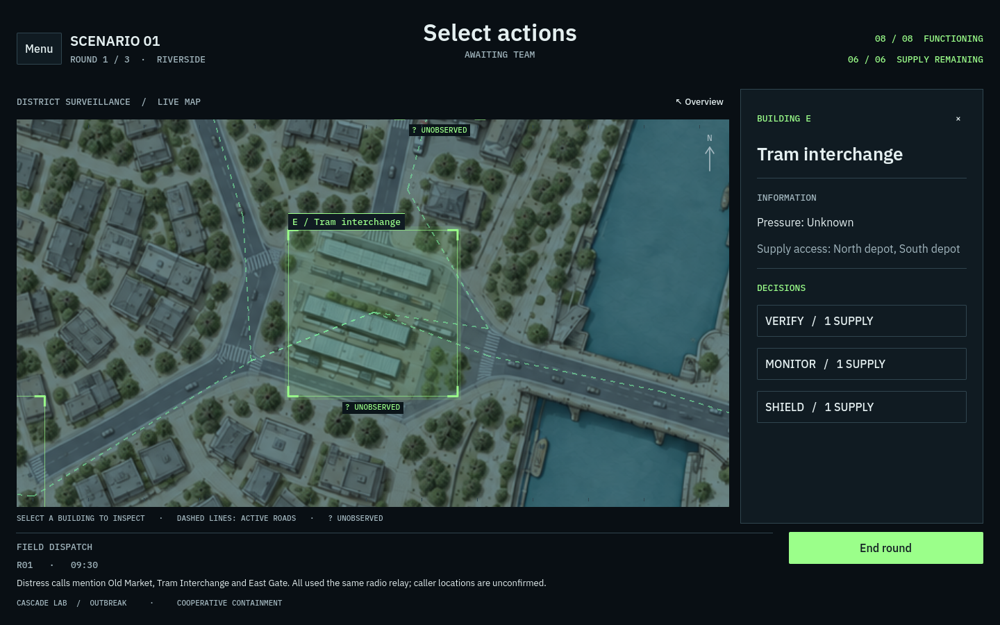

# Typography and contrast refinement

This pass preserves the dark console layout, font sizes, green frames, dark action buttons, and strongest green phase CTA.

## Rendering audit

The game text is rendered by Godot, not browser DOM typography. Computed styles on the canvas, body, and html showed opacity 1, no filter or backdrop-filter, no CSS transform, zoom 1, and no font-smoothing override. A 1280 × 720 CSS canvas had a 2560 × 1440 backing buffer at devicePixelRatio 2. A desktop test at DPR 1 used a matching 1440 × 900 backing buffer. There was no low-resolution canvas being enlarged by CSS.

Godot uses canvas_items stretch mode and automatic dynamic-font oversampling. These settings remain intact. This renders at the target resolution rather than stretching a fixed low-resolution viewport image. Font import settings use normal antialiasing, automatic oversampling, and no MSDF conversion. The font files' OS/2 metadata confirms the intended weights: Sans Regular 400, Sans Medium 500, Sans SemiBold 600, and Mono Medium 500. The bundled fonts contain the interface symbols tested; no replacement font was installed.

Reference: [Godot resolution and font-oversampling documentation](https://docs.godotengine.org/en/stable/tutorials/rendering/multiple_resolutions.html#font-and-image-oversampling).

## Shared hierarchy

| Role | Opaque color | Usage |
| --- | --- | --- |
| Primary | #F2F7F8 | Headings, building names, active information, button labels |
| Normal | #C8D3D7 | Field dispatches, support-message body, rich reading text |
| Secondary | #919EA4 | Descriptions, metadata, timestamps, inactive labels |
| Muted | #6E7C82 | Nonessential footer branding |

Important small Sans labels use the 500 cut. Headings retain 600. Active buttons use 600 on the existing dark surfaces; quiet navigation remains 500. Body paragraphs remain regular. The phase CTA retains its green fill and dark label.

Map captions keep their dark backing plates and fully opaque green glyphs. Their origins now align to render-target pixels, accounting for viewport scaling. A one-unit, 12%-opacity outline behind green text supplies a restrained halo; the opaque glyph is drawn last. Camera and road geometry remain continuous during focus animations. No broad blur, canvas shadow, or global opacity is introduced.

## Verification

- Updated UI suite: 184 checks, zero failures.
- Windowed redesign suite: 1,416 checks, zero failures, including every support template and survey bounds at 1440 × 900 and 1200 × 800.
- Before/after visual comparison also used a fixed 1440 × 900 logical layout displayed at 1200 × 800 and 1280 × 720 to inspect fractional scaling.
- Browser startup and focused-building rendering inspected; canvas density verified at DPR 1 and DPR 2.
- Browser export rebuilt, and build/cascade-lab-dark.zip checked for archive integrity.

## Before and after

