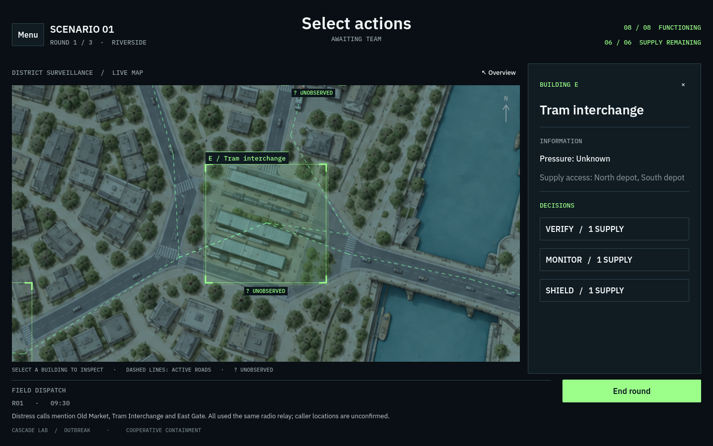
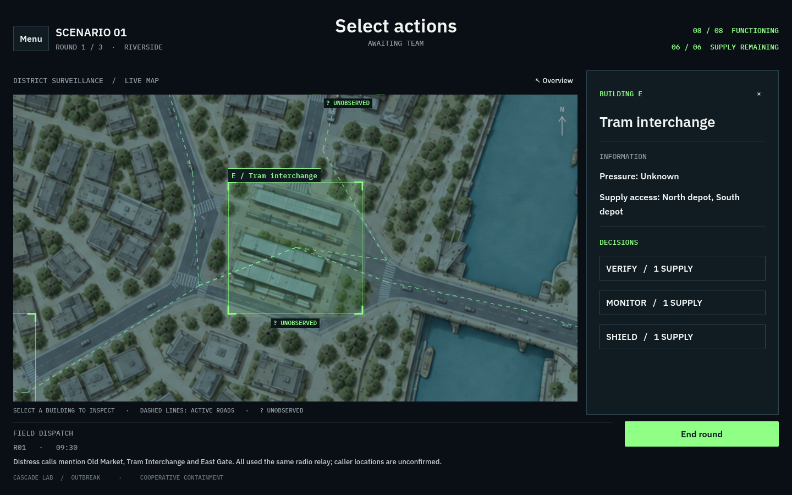

# Solid-core typography refinement

> Superseded for typography and surface colors by [Option A typography](OPTION_A_TYPOGRAPHY.md) (Barlow, Barlow Semi Condensed, Noto Sans SC, neutral-black surfaces). The rendering audit below remains accurate.

This second pass follows the requested printed-ink direction: opaque near-white primary text, distinct reading and metadata levels, and luminous effects confined to tactical map accents. Dark surfaces, interface structure, font sizes, camera behavior, and the green phase CTA are retained.

## Audit before editing

The `Select actions` heading was already #F2F7F8 at alpha 1, using IBM Plex Sans SemiBold. It had no outline or shadow. The issue was not a global opacity or bloom effect. Reading paragraphs still defaulted to secondary gray and Regular 400; important small labels used Medium 500, and map captions used Mono Medium. This weakened the distinction between reading content and metadata.

Runtime checks found white `modulate` and `self_modulate`, identity Control scales, and no materials on the UI tree. There is no CRT, vignette, blur, color-grading shader, or post-processing viewport in this project. The city's darker color is passed to `draw_texture_rect` for that image alone; it does not modulate labels. A modal intentionally dims the background behind its clean foreground panel. Adding a CanvasLayer would not fix an existing post-processing problem here because none exists.

The root uses `canvas_items`, keep-aspect scaling, and automatic font oversampling. Captured image sizes matched the actual display area: 1440 × 900 at native scale, 1200 × 750 inside a 1200 × 800 window, and 1152 × 720 inside a 1280 × 720 window. The remaining space is letterboxing. A larger native window was clamped by macOS to a 2640 × 1650 content area, which also matched its captured raster. There was no low-resolution whole-interface texture being enlarged. The stretch configuration therefore remains unchanged.

The rebuilt browser export was also inspected: a 1280 × 720 CSS canvas had a 2560 × 1440 backing buffer at DPR 2. HTML, body, and canvas had opacity 1, no filter/backdrop-filter/transform, and zoom 1.

## Shared changes

| Role | Color, alpha 1 | Treatment |
| --- | --- | --- |
| Primary | #F2F5F4 | Sans SemiBold 600 for headings, important values, action buttons, and primary labels |
| Normal | #C6CECF | Sans Medium 500 for body paragraphs and reading content |
| Secondary | #929FA2 | Medium 500 for metadata and intentionally subdued descriptions |
| Muted | #687679 | Nonessential footer branding |
| Active green | #8FFF86 | Solid tactical glyphs; Mono SemiBold 600 for important small status labels |

Ordinary text explicitly has zero outline and transparent shadow colors in the shared theme. Enabled button states, including hovered-and-pressed controls, keep solid foreground colors. Disabled text is an opaque secondary RGB color. The green CTA retains its dark lettering in every enabled state.

Paragraphs now default to the normal reading tier, not metadata gray. Pressure and supply access use the primary tier. Important map names and status stamps use the genuine IBM Plex Mono SemiBold cut, rather than synthetic emboldening or thicker outlines. Quieter metadata retains Mono Medium.

Font imports now use Normal/full hinting instead of the inherited Light hinting. This was compared visually at native and fractional display scales to strengthen stem alignment; grayscale antialiasing, automatic oversampling, and subpixel positioning remain enabled. The heading keeps its existing 34px size and 600 weight. No global sharpening filter or aggressive smoothing override was added.

Green map captions retain their one-unit, 12%-opacity halo behind an opaque core. Their backing plates and pixel-aligned origins remain intact. Ordinary white text receives no halo.

Font source and license: [IBM Plex Mono](https://github.com/IBM/plex/tree/master/packages/plex-mono/fonts/complete/ttf), bundled under assets/fonts/OFL.txt. Rendering references: [Godot font rendering](https://docs.godotengine.org/en/stable/tutorials/ui/gui_using_fonts.html) and [resolution/oversampling behavior](https://docs.godotengine.org/en/stable/tutorials/rendering/multiple_resolutions.html).

## Verification

- UI suite: 184 checks, zero failures.
- Windowed redesign suite: 1,416 checks, zero failures, covering survey bounds, support templates, and major phases at 1440 × 900 and 1200 × 800.
- Runtime typography audit: 2,584 checks, zero failures across action, menu, and survey trees; checks cover modulation, materials, text opacity, outlines, shadows, and output raster dimensions.
- Native before/after captures and fractional-size captures inspected visually.
- Browser build loaded and building selection verified with an actual click. Canvas density and computed styles checked in the rebuilt export.
- Browser export and build/cascade-lab-dark.zip rebuilt; archive integrity checked.

## Before and after

Before this second pass:

After:

