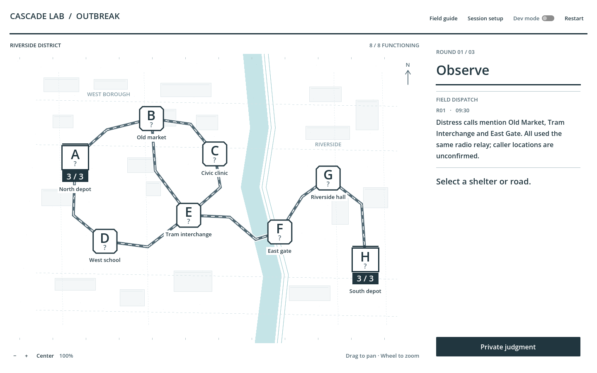
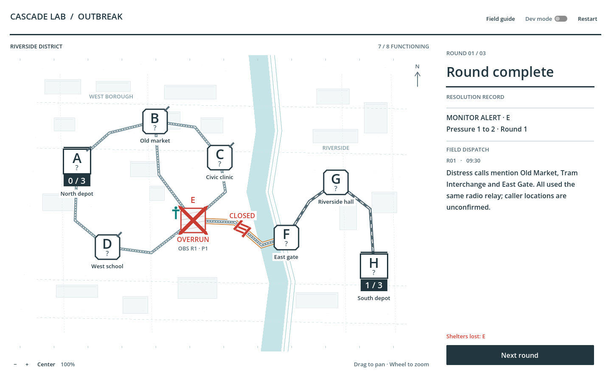
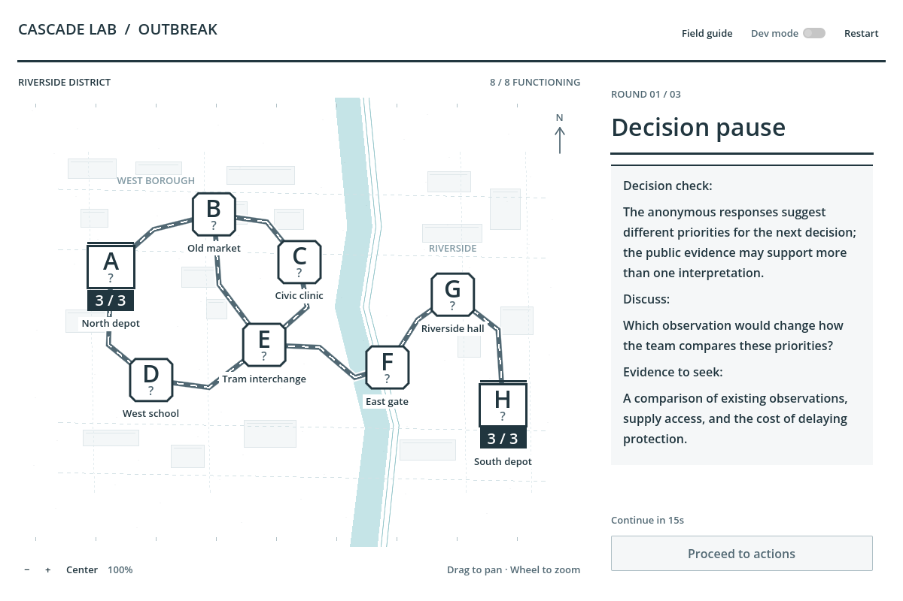
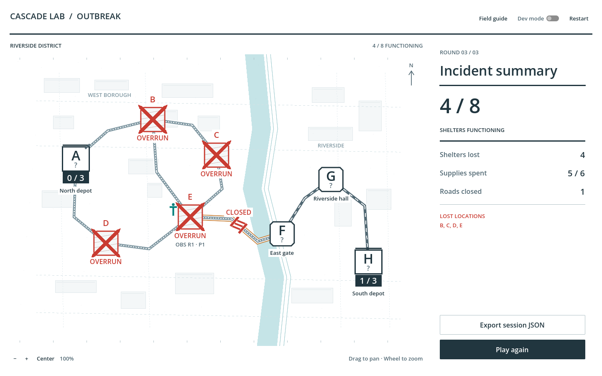

# Presentation redesign — September 15, 2026

Cascade Lab: Outbreak is a three-person cooperative strategy and research game played on one shared computer. The team manages eight shelters and two supply depots in Riverside District over three rounds. Public reports provide incomplete evidence; players record private structured judgments, discuss the situation, receive the assigned decision-support pause, and commit scarce supplies to Verify, Monitor, Shield, or Isolate. Unrevealed exposure remains uncertain until a permitted observation or a public Overrun transition. The research compares No AI, Direct Recommendation, and Constructive Dissent at the same point in the decision process.

The presentation now resembles a municipal operations map with a white decision sheet. The latest direction replaces the earlier beige/olive palette with white backgrounds, cool infrastructure, dark ink, teal observations/protection, amber selections, and red confirmed losses.

## Visual problems identified

- Repeated rounded cards gave setup, reports, decisions, and results the same visual weight.
- Beige/olive surfaces, thin status marks, and circular depots weakened the distinction between infrastructure, supplies, and confirmed losses.
- Small letter badges and glow effects required too much interpretation.
- Repeated headings, instructions, resource cards, and historical reports competed with the current decision.
- The shared dashboard composition made private handoffs and outbreak resolution insufficiently distinct.
- Private forms and long support notes needed more careful treatment in a smaller desktop window.

## Changes made

### Global design system

Centralized a white palette, four text levels, a spacing scale, nearly square controls, one-pixel rules, and heavier structural dividers in `ui_kit.gd`. Primary, secondary, caution, and quiet buttons have consistent treatments. Popup menus, tooltips, focus outlines, and scrollbars use the same system. The engine clear color is also white, eliminating the old beige frame during startup.

### Map

Shelters use chamfered markers; depots have distinct square outlines and large supply strips. Selection uses corner brackets. Monitors use large, four-pixel masts; shields use a heavy angular outline; dated verification records remain explicitly historical. Overrun shelters use hatched interiors and an eight-pixel X with pointed ends, with the location ID above the cross. Closed roads have physical barricades. Public supply unavailability uses a corner slash and road pattern rather than a green/red-only distinction.

Sparse authored buildings, survey marks, a pale cyan river, and deterministic cartographic texture provide context without changing network geometry. Unknown pressure is marked `?`. No decorative variation depends on unrevealed exposure.

### Phase UI

The map is the largest region. A 380-pixel decision column uses whitespace and rules instead of nested cards. The latest dispatch is prominent during observation and discussion; actions take precedence during commitment. Previous dispatches remain accessible through a disclosure control.

Private handoff replaces the map and form with an opaque white interstitial. Each new form starts blank and uses the public map only as reference. Discussion continues to withhold respondents' private views, preserving the existing anonymity constraint.

All three support conditions share one renderer, note bounds, text styles, spacing, and continuation control. Setup remains facilitator configuration. Results retain the final map and emphasize functioning shelters, losses, supplies spent, and roads closed.

### Typography

One bundled system face; display 32, section 20, body 16, caption 13. Important result numbers use 48. Status captions are larger than incidental map metadata, and depot stock is legible directly on the board. No external font or asset licensing dependency was added.

### Animation

Supply units travel as small trucks on existing delivery paths. Isolation places a barricade after endpoint delivery. Public outbreak movements use source brackets and route chevrons, with a shield reaction at a protected destination. New losses draw the pointed X. During these operations, the sidebar shows only the operation and target.

The reveal animation now copies its working list before clearing it. Previously, clearing the animation list could also clear the session's newly-overrun summary through an array alias. This is a presentation ownership fix, not a simulation-rule change.

### Text cleanup

Removed the redundant masthead subtitle, duplicate depot sidebar, repeated support heading, extra handoff footer, and written delivery-path recap. Action descriptions moved to tooltips; cost, target, and disabled reasons remain visible. Rules and the map key remain in Field guide. Public reports and experimental messages retain their exact wording.

## Files and navigation

| File | Responsibility |
| --- | --- |
| `scripts/ui/ui_kit.gd` | Palette, text levels, spacing, reusable control styles. |
| `scripts/ui/network_view.gd` | Map geometry rendering, bold status marks, pointed cross, animation. |
| `scripts/ui/main.gd` | Phase compositions, privacy interstitial, support note, dialogs, action controls. |
| `scripts/ui/presentation_text.gd` | Ordinary labels, tooltips, phase names, map key. |
| `project.godot` | White engine clear color only for this redesign. |
| `tests/test_presentation.gd` | Six complete sessions, desktop bounds, equal support bounds, public-pixel privacy, animation ownership. |
| `tests/test_support.gd` | Updated note child-count assertion for the removed duplicate heading; behavioral assertions retained. |
| `README.md`, `docs/DEVELOPER_HANDOFF.md`, `docs/VALIDATION.md` | Current design, navigation, validation, and upload instructions. |

The workspace also contains earlier controlled-support implementation changes. Those predate this visual pass. The root scene and domain architecture were preserved.

## Gameplay and research guarantees

Checksums taken before the redesign still match every gameplay manager, model, scenario JSON, support adapter, support library, and event logger. Outbreak progression, supply routes, costs, legality, effects, rounds, scenario contents, public reports, hidden-state rules, support algorithms/text/version, condition assignment, 15-second exposure timing, research variables, anonymity, and export schema are unchanged by this pass. Both support modes use their existing permitted inputs. No external service was added.

The 0.22-second barricade placement is presentation time only; closure still commits after both supplies arrive. Public resolution animation never previews hidden P0/P1 progression.

## Validation and build

See [the validation record](VALIDATION.md) for final automated counts and browser scenarios. The upload archive is `build/cascade-lab-operations.zip`, containing the Web export files directly at its root. Upload it in place of the previous itch.io archive and retain the browser-playable setting.

## Remaining visual weaknesses

- This is a desktop layout. Portrait phones and very small embeds need a separate layout pass.
- Native Godot dropdown menus remain utilitarian. Long depot assignments can require more reading than ordinary action selection.
- Dated records, monitor marks, and Dev annotations can still crowd a shelter at extreme zoom or pan positions; the standard desktop framing is the tested target.
- Survey marks and status meaning still benefit from a first read of the map key. The design intentionally avoids adding permanent explanatory paragraphs to the board.

## Screenshots

